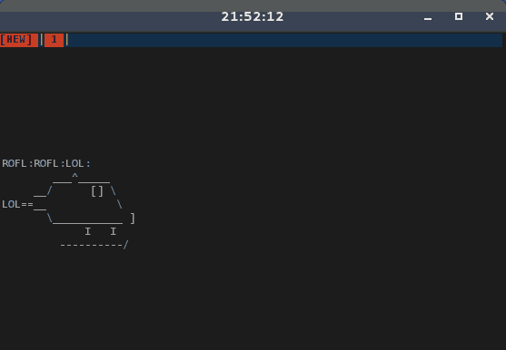

# rolfcopter

Nothing is more fun that watching a roflcopter fly!



## Compilation

```bash
make
```

## Installation
To be executed as root.
```bash
make install
```

## Uninstall
To be executed as root.
```bash
make uninstall
```

## Further Reading

0. [License](LICENSE.md)
